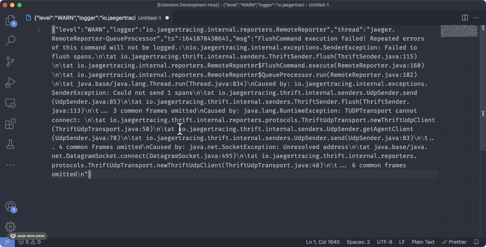
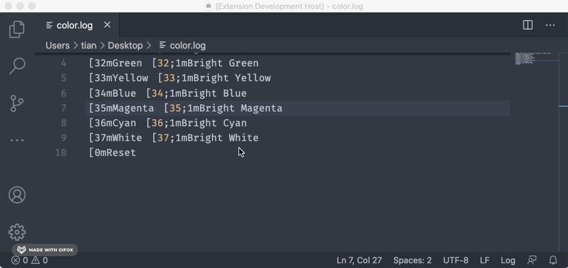
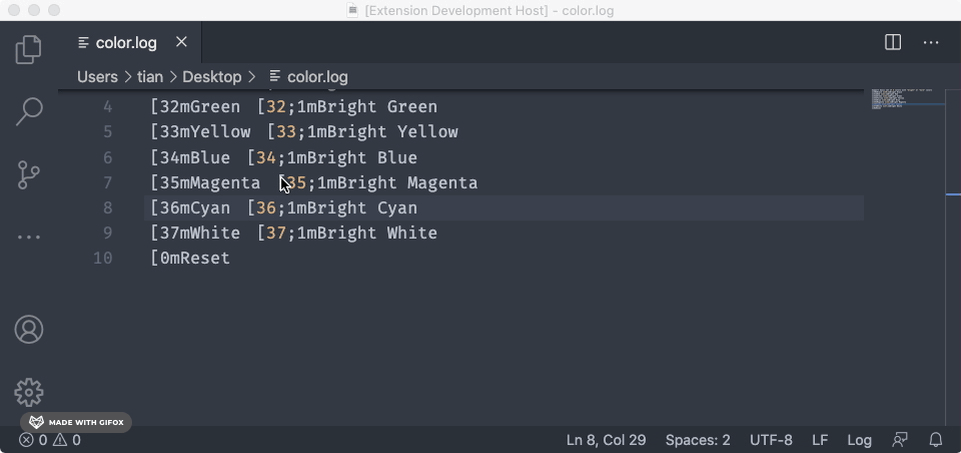

# tidy-your-text

`tidy-your-text` is a set of handy utilities to help tidy your text.

## Features

### Format Stacktrace

Format stringified stacktrace in logs.

### Remove ANSI color codes

Removes ANSI color codes in logs.

## Requirements

## Extension Settings

## Known Issues

## Release Notes

### 1.0.0

Initial release

- Format stacktrace
- Remove ANSI color code
